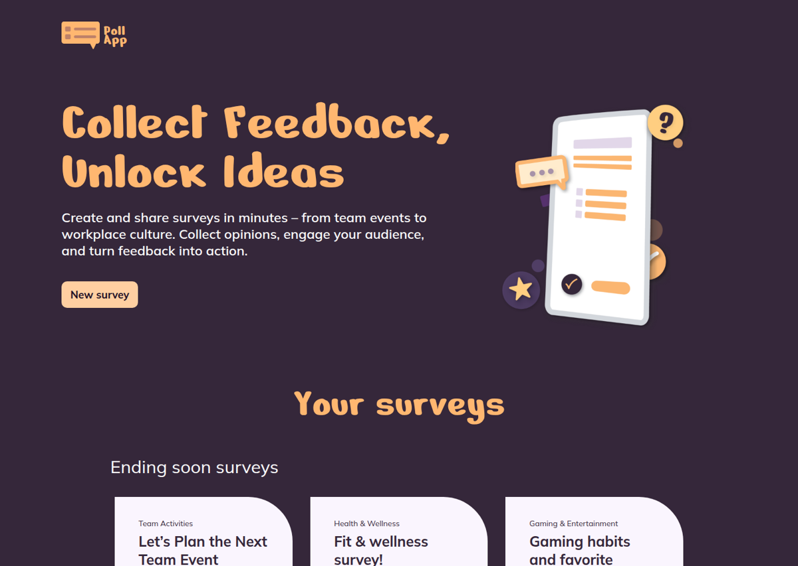
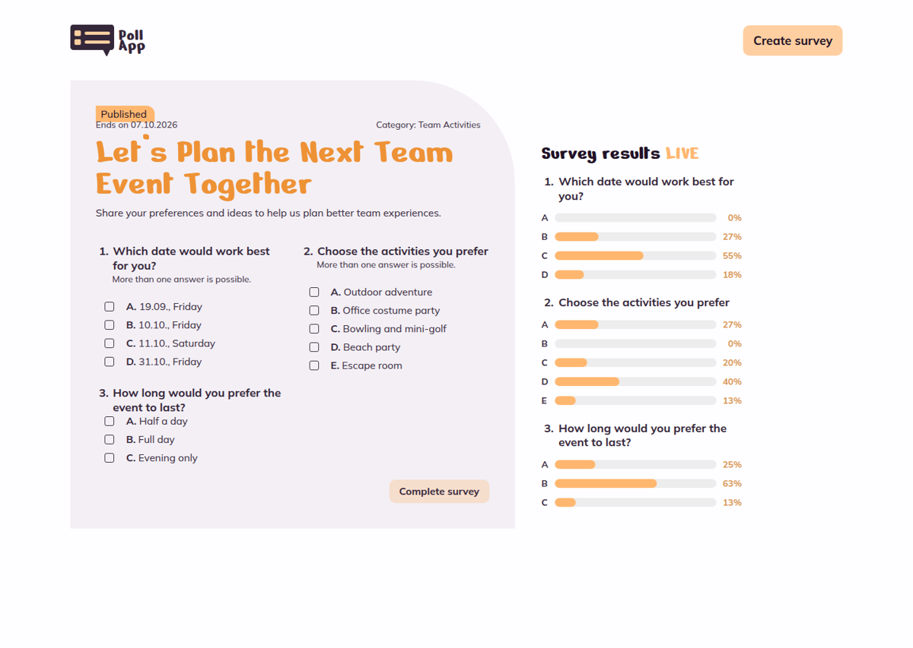
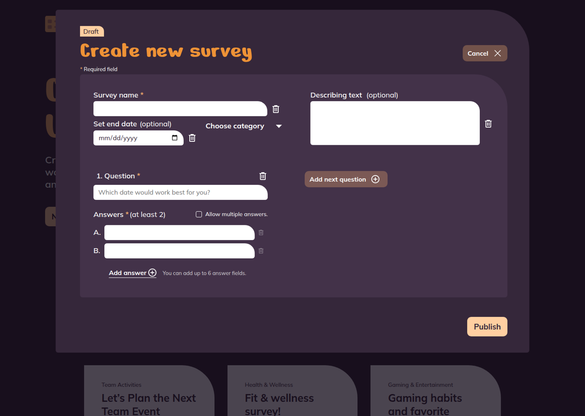

# Poll App



### 📋 Overview

Poll App is a real-time survey application built with Angular and Firebase. Users create surveys with several questions, vote once per survey and watch the results update live for everyone, without reloading the page. The interface follows a Figma design on desktop and mobile and works down to a screen width of 320 px.

🔗 **Live demo:** [christiannoack.developerakademie.net/poll-app](https://christiannoack.developerakademie.net/poll-app/)

## 🛠️ Built with

- Angular 21 (standalone components, signals, reactive forms)
- TypeScript
- SCSS (CSS custom properties, no UI framework)
- Firebase Firestore (live updates)
- Prettier

## ✨ Features

- **Ending soon:** the three active surveys with the nearest end date are highlighted at the top.
- **Active / past surveys:** tabs switch between running and finished surveys, each with its own category filter.
- **Create survey:** overlay dialog with title, category, optional end date, optional description and any number of questions with 2 to 6 answers. After publishing, a confirmation is shown and the app returns to the home page after 3 seconds.
- **Voting:** one vote per survey and browser. Expired and already voted surveys are read-only.
- **Live results:** percentage bars per question, updated in real time through Firestore snapshots. Selecting an answer is previewed in the results right away, and the vote is saved only when the survey is completed. On mobile the results can be folded away.
- **Validation:** messages appear inside the input fields, so the layout never shifts.
- **Seed data:** an empty database is filled with example surveys on the first start.

### Input limits

| Field         | Rule                                              |
| ------------- | ------------------------------------------------- |
| Survey name   | required, max. 30 characters                      |
| Category      | required                                          |
| End date      | optional, not in the past                         |
| Description   | optional, max. 200 characters                     |
| Question text | required, max. 50 characters                      |
| Answer text   | required, max. 50 characters, 2 to 6 per question |

## 🖼️ Screenshots

| Survey detail                                          | Create survey                                          |
| ------------------------------------------------------ | ------------------------------------------------------ |
|  |  |


## ⚙️ How to Use

1. Clone the repository:

   ```bash
   git clone <your-repository-url>
   ```

2. Navigate to the project directory:

   ```bash
   cd poll-app
   ```

3. Install the dependencies (Node.js 20.19 or newer):

   ```bash
   npm install
   ```

4. Add your Firebase web config in `src/environments/firebase.config.ts`:

   ```ts
   export const FIREBASE_CONFIG = {
     apiKey: '...',
     authDomain: '...',
     projectId: '...',
     storageBucket: '...',
     messagingSenderId: '...',
     appId: '...',
   };
   ```

5. Start the development server and open `http://localhost:4200/`:
   ```bash
   npm start
   ```

### Firestore rules

Surveys are stored in the `surveys` collection. The rules must allow reading, creating and updating the `votes` field, for example:

```
rules_version = '2';
service cloud.firestore {
  match /databases/{database}/documents {
    match /surveys/{surveyId} {
      allow read, create: if true;
      allow update: if request.resource.data.diff(resource.data).affectedKeys().hasOnly(['votes']);
    }
  }
}
```

These rules are open on purpose for a demo. Adjust them before production use.

### Build

```bash
npm run build
```

To deploy under a subfolder, set the base path, for example `ng build --base-href /poll-app/`.

The app uses hash routing (`/#/survey/<id>`), so reloading a page works on any static host without server rewrite rules.

## 🗂️ Project structure

```
src/app
├── components
│   ├── category-dropdown      category filter
│   ├── create-survey-dialog   create dialog and publish confirmation
│   ├── site-header            logo and "Create survey" button
│   ├── survey-card            card in the featured row and in the list
│   ├── survey-results         live result bars
│   └── survey-vote            questions and answer inputs
├── models                     survey interfaces and constants
├── pages
│   ├── home                   hero, ending soon, tabs, list
│   └── survey-detail          survey with voting and results
├── services                   Firestore access, dialog state, seed data
└── utils                      date helpers, form validators, vote keys
```

Votes are stored per survey as `votes["<questionId>_<answerId>"]` and counted with Firestore's `increment(1)`, so parallel votes never overwrite each other.

## ⚠️ Known limits

- "One vote per survey" is enforced in the browser only (`localStorage`). There is no authentication.

## ✍️ Author

- Chris Noack (CN Security & Systems)
- [Website](https://christian-noack.com)
